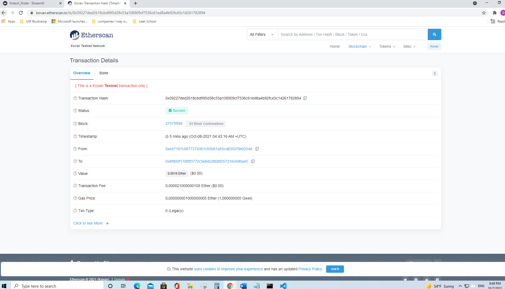

# Challenge19


# Fintech Finder

This Python file builds a new and disruptive platform called Fintech Finder. Fintech Finder is an application that its customers can use to find fintech professionals from among a list of candidates, hire them, and pay them.

---

## Technologies

This project leverages Python 3.7, its library Streamlit, bip44, typing, and dataclasses with the following packages and dependencies:

* [streamlit](https://streamlit.io/) - Streamlit turns data scripts into shareable web apps in minutes

* [bip44](https://en.bitcoin.it/wiki/BIP_0044) - Defines a logical hierarchy for deterministic wallets

* [web3](https://ethereum.org/en/developers/docs/web2-vs-web3/) - Decentralized apps that run on the blockchain

* [typing](https://docs.python.org/3/library/typing.html) - Support for type hints

* [dataclasses](https://docs.python.org/3/library/dataclasses.html) -  Provides a decorator and functions for automatically adding generated special methods

* [dotenv](https://www.npmjs.com/package/dotenv) - A zero-dependency module that loads environment variables from a .env file into process.env

---

## Installation Guide

Python 3.7, pandas, streamlit, and VS Code are required to be installed before running the application.

`pip install streamlit`

---

## Usage

To run the application simply clone the repository and run the **fintech_finder.py** with:

```
streamlit run fintech_finder.py

```

Streamlit application sidebar

  

Client's address balance and history

  

Transaction hash

  

TO address balance and history

  

---

## Contributors

Brought to you by Christine Guo (www.linkedin.com/in/christine-guo)

---

## License

NoNe